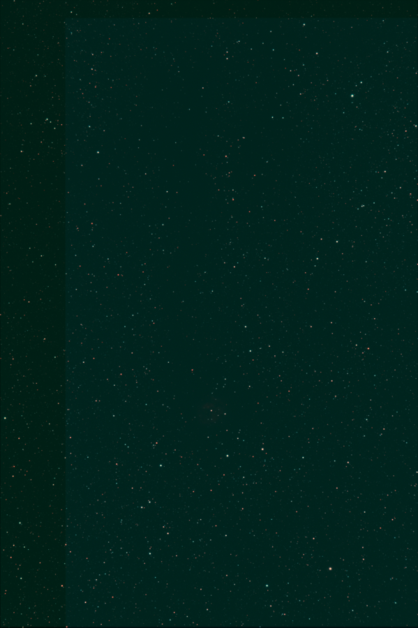

# Astrophotography Stacking Pipeline

This project is a Python pipeline that takes a set of night-sky exposures and processes them into one clean, noise-reduced image. It aligns frames to a common reference and stacks them before applying a stretch. Ideally I built it to work on iPhone photos taken with the right specifications.

It also handles a second kind of input with the same code path:

- **Phone photos**: JPEG or RAW/DNG, usually just light frames, no calibration set. Calibration is skipped automatically.
- **DSLR practice datasets**: Canon CR2 or FITS, with matching dark, flat, and bias calibration frames. Calibration runs automatically when those frames are present.

## Result



25 real light frames (240s each, Canon DSLR) of the Cocoon Nebula (IC 5146) region, calibrated against real dark/flat/bias frames and stacked with this pipeline. Stars are sharp with no trailing or doubling artifacts. In the future I want to add color calibration to emphasize the nebula itself.

## The story

The pipeline was built one stage at a time: loading, calibration, alignment, stacking, then post-processing. Each stage had tests against synthetic data with known answers. A known offset in a fake dark frame had to subtract out to zero. A known pixel shift had to be recovered by alignment. Stacking identical frames had to return the same frame back. All of this passed before the pipeline ever touched a real photo.

Then it ran on a real 80-file DSLR dataset, the Cocoon Nebula set above, and two real bugs showed up right away.

1. **The file sorter was misreading every filename.** A regex like `\bbias\b` does not match `Bias_000.fits`, because underscores count as word characters in regex, so there is no boundary there. Every calibration frame was quietly getting treated as a light frame. This dataset also used single-letter names (`L_`, `D_`, `F_`, `B_`), which the first fix still did not catch. Both problems are fixed now, with tests that use the real filenames that broke it.
2. **The pipeline could not handle full-resolution DSLR files.** Loading every frame into memory at once needed about 17 GB for this 80-file set, more than the 16 GB machine it ran on had. Instead of just noting that limit, the pipeline now checks the estimated size of a folder first. If it is too big, it switches to a streaming mode that processes one frame and one row of pixels at a time, using temporary files on disk instead of RAM. See [In-memory vs. streaming mode](#6-in-memory-vs-streaming-mode) below.

After both fixes, the full 80-file set (25 lights, 9 darks, 23 flats, 23 bias) ran start to finish and produced the image above. Background noise dropped by 2.0x and signal-to-noise improved by about 1.9x after stacking. That is lower than the theoretical value of sqrt(25) = 5.0x, for real reasons: alignment resampling blurs neighboring pixels together, the dark frames were shot across a range of sensor temperatures instead of one fixed temperature, and the last 5 frames look like a separate session with fewer matched stars during alignment.

## Install

```bash
python -m venv .venv
.venv\Scripts\activate      # Windows
# source .venv/bin/activate # macOS/Linux
pip install -r requirements.txt
```

## Usage

```bash
python stack.py --input ./my_photos --output result.tiff --stack sigma
```

Drop every file for one session into a single input folder. This can include lights, and optionally darks, flats, and bias frames. Point `--input` at that folder. The pipeline sorts files automatically (see [Loading](#1-loading--sorting) below) and either calibrates or skips calibration depending on what it finds.

### CLI options

| Flag | Default | Meaning |
|---|---|---|
| `--input` | *(required)* | Folder of input images |
| `--output` | *(required)* | Output path; `.tiff` saves 16-bit, anything else saves 8-bit |
| `--stack` | `sigma` | Combine method: `mean`, `median`, or `sigma` |
| `--sigma-thresh` | `3.0` | Sigma-clip rejection threshold (only used by `--stack sigma`) |
| `--sigma-maxiters` | `5` | Sigma-clip max iterations |
| `--stretch` | `asinh` | Display stretch: `percentile`, `asinh`, or `none` |
| `--reference` | `0` | Index of the light frame used as the alignment reference |
| `--recursive` | off | Scan `--input` recursively |
| `--bit-depth` | `16` | Output bit depth for TIFF (`8` or `16`) |
| `--memory-budget-mb` | `3072` | Above this estimated data size, switch to memory-bounded streaming mode. `0` forces streaming always. |
| `-v`, `--verbose` | off | Debug-level logging |

The CLI prints a before and after noise and SNR report for every run. That gives a real number for whether stacking actually helped, not just a nicer-looking picture.

## How it works

### 1. Loading & sorting

Every file in the input folder gets decoded and sorted into light, dark, flat, or bias by filename. An explicit prefix like `Light_`, `Dark_`, `Flat_`, or `Bias_` is recognized. So is the single-letter version some tools use: `L_`, `D_`, `F_`, `B_`. Any file with no recognizable keyword, like a phone photo or a descriptive name such as `M42_300s_001.fits`, gets treated as a light frame. That is the only frame type you would capture without labeling it.

What each frame type actually is:

- **Light**: the real exposure. Target signal plus every noise source: photon shot noise, sensor read noise, and thermal "dark current".
- **Dark**: shot with the sensor capped, at the same exposure time and temperature as the lights. No light signal, just the thermal and read-noise pattern, so it can be subtracted back out of a light frame.
- **Flat**: a picture of a uniformly lit target, like twilight sky or a light panel. No astronomical signal, but it records multiplicative optical defects like vignetting and dust shadows. It gets used as a divisor, not subtracted.
- **Bias**: a zero-length exposure. Isolates the sensor's read-noise offset with no thermal component at all.

Supported formats: JPEG, PNG, and TIFF through `imageio`; Canon, Nikon, and other RAW formats (`.cr2`, `.nef`, `.dng`, and more) through `rawpy` and LibRaw; and FITS through `astropy`.

RAW files get demosaiced with gamma disabled and auto-brightness off (`rawpy.postprocess(gamma=(1,1), no_auto_bright=True)`). This keeps pixel values roughly proportional to the light that was captured, which keeps the calibration math valid. It is a simplification though. The more rigorous approach calibrates the raw Bayer mosaic before demosaicing, since flat-fielding corrects per-pixel sensor response and demosaicing interpolates between pixels. This pipeline demosaics first and calibrates the RGB result instead. That is simpler and still removes most of the vignetting and dark current, at the cost of some fine per-pixel accuracy.

### 2. Calibration (optional)

If no dark, flat, or bias frames are found, this stage is skipped entirely and logged. Lights pass straight to alignment. This is what makes the phone-photo path work with no calibration set at all.

If calibration frames do exist, each set gets combined into a master frame using a per-pixel median, not a mean. A median rejects one-off outliers, like a cosmic ray hit or a hot pixel that spiked in a single sub-frame, that a mean would blend into the result instead.

The correction applied to every light frame:

```
calibrated = (light - master_dark) / normalized_master_flat
```

- Subtracting the master dark removes the additive thermal and read-noise pattern.
- Dividing by the flat, after normalizing it to a mean of 1, removes vignetting and dust shadows without changing overall brightness.
- Bias is not subtracted from the light directly when a matching dark exists. A dark frame already contains that same read-noise offset, since a dark exposure is really "bias plus thermal noise." Subtracting both would remove it twice. Bias gets used instead to clean up the flat, or as a fallback stand-in for dark subtraction when no matching dark is available. That fallback only removes the fixed offset, not the thermal buildup, so it is an approximation that works fine for short exposures.

### 3. Alignment (registration)

Between exposures the target drifts across the sensor, from tracking error, polar misalignment, or just a handheld camera moving. So every frame needs to be resampled onto the same pixel grid as a reference frame before stacking. Three approaches were considered:

- **astroalign (triangle matching between star patterns)**: it finds star-like points, forms triangles out of triplets of them, and matches triangles between frames by their shape, since the ratio of triangle side lengths stays the same regardless of rotation, scale, or translation. This is robust and handles field rotation, but it needs a handful of well-detected stars. It has nothing to work with on 1 or 2 stars, or a diffuse target like the Moon.
- **Generic feature matching (ORB or SIFT with RANSAC)**: this works on textured, non-stellar content like lunar craters, but stars are small and nearly identical blobs, so feature descriptors barely tell one star apart from another. Not a good fit for star fields, which is the common case here.
- **Phase correlation (FFT cross-correlation)**: this computes the pixel shift directly from the phase of the cross-power spectrum, with no point detection needed. It is fast and robust, and it still works when there is only one dominant feature, like a Moon shot or a couple of stars. Its limit is that it only recovers translation, not rotation.

Decision: astroalign is tried first, since it is the only one of the three suited to dense star fields. If it cannot find enough matched stars, whether it raises an error or is not installed, the frame falls back automatically to phase correlation. That one fallback rule is what lets the same code handle both a rich star field and a sparse Moon shot.

### 4. Stacking

Why does stacking reduce noise at all? Assume each pixel's noise, from shot noise and read noise, is independent from frame to frame. Averaging N frames makes the signal add up linearly, N times over, while independent noise only grows by the square root of N. So signal-to-noise improves by the square root of N. That is the whole reason deep-sky imaging stacks many sub-exposures instead of taking one long one.

Three combine methods:

- **Mean**: statistically optimal for independent Gaussian noise, and gets the full square-root-of-N improvement. But it has no concept of "this pixel is wrong." A satellite trail or cosmic ray hit in even one frame gets blended into the result.
- **Median**: immune to a minority of contaminated frames. A trail or hit vanishes completely, as long as fewer than half the frames are bad at that pixel. The cost is statistical efficiency. For large N its noise is about 1.25 times the mean's, so it needs about 1.57 times as many frames to match the mean's noise reduction.
- **Sigma-clipped mean (the default)**: per pixel, compute the mean and standard deviation across the stack, mask any value more than `--sigma-thresh` standard deviations away, then average what is left. This rejects outliers like the median does, while staying close to the mean's noise performance. It is what tools like DeepSkyStacker and PixInsight use by default, and it needs a handful of frames, five or more, for the per-pixel statistics to mean anything.

The CLI reports background noise and signal-to-noise for the reference frame versus the final stack, along with the theoretical square-root-of-N prediction. That gives a real number instead of just a nicer-looking picture.

### 5. Post-processing

Stacked data is linear, with an enormous dynamic range. The sky background and faint nebulosity sit just above zero, while stars are orders of magnitude brighter. Displayed linearly, that looks like a black frame with a few white dots. Two stretch options remap intensity so faint detail becomes visible:

- **Percentile**: pick a low and high percentile as the black and white point, then rescale linearly between them. Simple, but a linear map cannot reveal faint detail and protect bright cores at the same time when the dynamic range is this large.
- **Asinh (the default)**: `asinh(x)` behaves like `x` for small values and like `log(x)` for large ones. That is exactly the shape needed. Faint, near-background signal gets stretched close to proportionally, while bright signal like stars gets compressed logarithmically instead of clipping to solid white. This is the same idea behind the "Lupton stretch" used for SDSS survey images.

Both stretches compute black and white points across all channels together, not per channel, so color balance does not get skewed. Nothing in this stage corrects color balance though. That gap is what the next steps section below is about.

### 6. In-memory vs. streaming mode

There are two ways the pipeline actually runs, and it picks between them automatically. The simple approach is to decode every file into a normal array in RAM and keep all of them around at once. That is easy and fast, but N frames at height times width times channels times 4 bytes each (float32) means N times that much RAM all at once. A session of full-resolution DSLR frames adds up fast. 80 frames at about 24 megapixels, demosaiced to RGB, comes out to around 17 GB, more than most machines have free.

Before doing any real work, the pipeline estimates the total decoded size of the input folder cheaply. RAW files only get header-parsed, with no demosaic. FITS files get sized from header keywords. Standard images get opened lazily. None of that needs actually decoding pixel data. If the estimate goes over `--memory-budget-mb` (3072 MB by default), the pipeline switches to a streaming mode instead:

- Every file gets decoded one at a time and written straight to a temporary memory-mapped file on disk, dropping the copy in RAM. Peak RAM for loading is one frame, not N.
- The two steps that genuinely need to see every frame at a given pixel, median-combining the calibration masters and the final stack, happen in horizontal row bands. Read a band of rows from every frame's memmap, combine just that band with the same `stack_mean`, `stack_median`, or `stack_sigma_clip` functions used everywhere else, write it out, move to the next band. Peak RAM for combining is tuned to a fixed budget no matter how many frames there are or how large they are.
- Calibration and alignment, which only ever need one frame plus the already-small master arrays, happen in that same one-file-at-a-time pass. Temporary files get deleted as soon as they are no longer needed instead of piling up for the whole run.

The streaming path is slower, since it uses disk instead of RAM and each row-band combine has some fixed overhead. So it only gets used when the size estimate says it is needed. Force it with `--memory-budget-mb 0` if you would rather not rely on the estimate.

## Next steps

**Color calibration.** The current result has a strong green cast. Bayer sensors are naturally green-heavy, with twice as many green photosites as red or blue in the RGGB pattern, and the post-processing stage right now only stretches brightness. It does not correct color balance at all. Here is the plan, roughly in the order it would get built:

1. **Background neutralization, first.** The pipeline already computes sigma-clipped background statistics per image for the noise and SNR report (`stacking.measure_noise_snr`). Extending that to run per channel would give the background level of red, green, and blue separately. Scaling each channel so those three levels match, on the assumption that the night sky itself should be neutral and not green, is a simple and cheap fix that would remove most of the cast on its own, applied before the stretch.
2. **SCNR-style green suppression, as a complement.** A common finishing touch in astro tools for leftover green: clamp each pixel's green channel to no more than the average of its red and blue. This targets exactly the broad green cast seen here, without touching real green astronomical signal, which is rare, since most real nebula color is red, blue, or magenta.
3. **Photometric color calibration, the more rigorous version, later.** Real tools calibrate color by comparing measured star colors in the image against catalog color values, like Gaia. That needs star detection and a catalog cross-match, meaningfully more work than steps 1 and 2, and probably not worth it until the simpler passes turn out not to be enough.
4. **A mild saturation boost after calibration.** Nebula color usually looks pretty desaturated in linear data even once it is neutrally balanced. A small saturation lift after steps 1 and 2 is what makes color "pop" the way processed astrophotos usually look, without that being a color-accuracy step on its own.

Two smaller things worth doing too:

- **Crop to the common overlap.** The result has a faint rectangular seam near one edge, the "stacking footprint" effect, where frames registered with slightly different sub-pixel shifts do not all cover exactly the same area, so the border gets thinner coverage than the center. Cropping the final stack to the overlap of every frame's footprint, or feathering that edge, is standard practice and is not implemented yet.
- **A stronger default stretch**, or an easy way to rerun just the post-processing stage with different stretch settings without recalibrating, realigning, and restacking from scratch. Useful for adjusting to taste before committing to a full rerun.

## Project layout

```
stack.py                   # CLI entry point
astro_stack/
    loader.py               # read a folder, decode formats, sort by type
    calibration.py           # master dark/flat/bias + calibration math
    alignment.py              # astroalign + phase-correlation registration
    stacking.py                # mean/median/sigma-clip + noise/SNR measurement
    postprocess.py              # percentile/asinh stretch + save
    streaming.py                 # memory-bounded pipeline for large sessions
    pipeline.py                   # picks streaming vs. in-memory, wires stages together
tests/
    test_loader.py               # filename classification
    test_calibration.py           # synthetic dark/flat removal
    test_alignment.py              # recovers a known injected shift
    test_stacking.py                # N identical frames -> same frame
    test_streaming.py                # chunked combine matches eager combine
```

## Tests

```bash
pytest tests/ -v
```

- `test_stacking.py`: stacking N identical frames (mean, median, sigma, mono and color) returns that same frame.
- `test_alignment.py`: injects a known sub-pixel shift into a synthetic star field and a synthetic sharp-edged "Moon" disk, then checks the aligned output has close to zero residual shift against the reference.
- `test_calibration.py`: a synthetic dark frame with a known constant offset gets subtracted out exactly, a synthetic flat with a known vignetting pattern gets divided out, and calibration is confirmed to be a clean no-op when no calibration frames are present.
- `test_loader.py`: filename-based frame-type classification, including the underscore-prefix case (`Bias_000.fits`, `Dark_005s_000.fits`, and so on) and the single-letter DSLR convention (`L_`/`D_`/`F_`/`B_`) that broke on first contact with real data.
- `test_streaming.py`: the chunked, memmap-backed combine used by streaming mode produces the same result as the plain in-memory combine, and the full streaming pipeline agrees with the in-memory pipeline on the same synthetic dataset.
